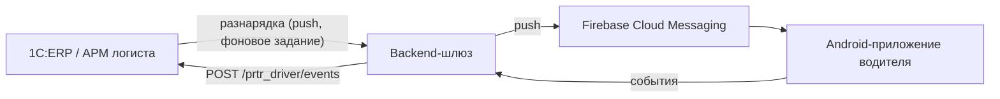

# Архитектура и модель работы — приложение водителя

*Версия 2 — обновлено по итогам согласования контракта обмена с 1С-командой.*

## 1. Назначение документа

Описывает архитектуру со стороны нашей части системы (backend-шлюз + Android-приложение водителя), зоны ответственности между командами и модель работы приложения. Документ — общий референс для всей команды: 1С-разработчиков, Python-разработчика и нас.

---

## 2. Команда и зоны ответственности

| Роль | Кто | Владеет |
|---|---|---|
| 1С-разработчики (2 чел.) | заказчик | АРМ логиста, разнарядки, путевые листы, вся бизнес-логика диспетчеризации, данные; параллельно строят АРМ медработника и механика |
| Python-разработчик | заказчик | отдельный сервис сбора и обработки данных о расходе топлива водителей |
| Backend + Android (мы) | мы | тонкий шлюз между 1С и приложением, нативное Android-приложение водителя |

**Принцип разделения:** 1С — единственный источник правды и владелец всех бизнес-данных. 1С с телефоном не общается напрямую и о телефонах ничего не знает — её контрагент только шлюз. Наша часть системы не хранит и не дублирует бизнес-данные — она передаёт их между 1С и телефоном водителя.

---

## 3. Общая архитектура



**Роли компонентов:**

- **1С / АРМ логиста** — формирует разнарядки, хранит все данные. Запись документа ставит его в очередь отправки и немедленно запускает фоновое задание (задержка — секунды). Регламентное задание раз в 5 минут — страховка на случай, если первая попытка не прошла (шлюз лежал, сеть моргнула). Для нас это выглядит как push по событию.
- **Backend-шлюз** — stateless-сервис без собственной БД бизнес-данных. Принимает разнарядки от 1С, вызывает push через Firebase, авторизует запросы от приложения, форвардит события в 1С.
- **Android-приложение** — нативный клиент водителя: получает push, показывает разнарядку, копит события локально при отсутствии связи, отправляет их в шлюз.

**Аутентификация:** токен в заголовке `X-Auth-Token` поверх HTTPS с обеих сторон (1С↔шлюз). Отдельная учётка на каждого водителя в 1С не нужна — контрагент 1С один: шлюз, а не 50 телефонов.

---

## 4. Документ «Разнарядка»

`ПрТр_Разнарядка` — задание на **один день** на **один экипаж** (машина + водитель). Одна машина за день = одна разнарядка, независимо от числа рейсов.

Табличная часть `Ездки` — список рейсов «погрузка → разгрузка», обычно 2–8 в день. Формируется автоматически из планировщика слотов; плановые времена берутся из слота.

**Регламент:** диспетчер формирует разнарядки до **17:00 на следующий день**. До начала смены разнарядка может быть переиграна — тогда уходит новая версия документа, а ознакомление водителя сбрасывается.

### Статусная модель

**Разнарядка** (производная от фактических времён, вручную статус не двигают, кроме закрытия):

```
Черновик → Отправлена → Ознакомлен → СменаНачата → Выполняется
         → СменаЗавершена → Закрыта (закрывает диспетчер вручную,
                              после проверки пробега и топлива)
                                       Отменена (в любой момент)
```

**Ездка:**

```
Назначена → Принята → НаПогрузке → ВПути → НаРазгрузке → Разгружен
                                                          Сорвана
                                                          Отменена
```

### Формат XML (1С → шлюз)

Документ самодостаточный — справочники (водитель, машина, точки маршрута) едут внутри, отдельной синхронизации НСИ нет.

```xml
<?xml version="1.0" encoding="UTF-8"?>
<Разнарядка>
  <Идентификатор>b1e4f207-9a3c-4d15-8e77-0c6b5a4d3e2f</Идентификатор>
  <Версия>3</Версия>
  <Номер>ПрТр-000412</Номер>
  <ДатаВыезда>2026-09-10</ДатаВыезда>
  <Статус>Активна</Статус>
  <ПричинаОтмены></ПричинаОтмены>
  <Водитель>
    <Идентификатор>3c9d1a55-77e2-4f0b-8a6c-1d2e3f405162</Идентификатор>
    <ФИО>Иванов Иван Иванович</ФИО>
    <ТабельныйНомер>00-0000123</ТабельныйНомер>
  </Водитель>
  <Машина>
    <Идентификатор>7a1b2c3d-4e5f-4a6b-8c9d-0e1f2a3b4c5d</Идентификатор>
    <Наименование>КАМАЗ 65115</Наименование>
    <ГосНомер>А123ВС43</ГосНомер>
  </Машина>
  <ПланВыезда>2026-09-10T07:00:00+03:00</ПланВыезда>
  <ПланВозврата>2026-09-10T17:30:00+03:00</ПланВозврата>
  <Ездки>
    <Ездка>
      <Идентификатор>e5f6a7b8-1c2d-4e3f-9a0b-5c6d7e8f9a0b</Идентификатор>
      <Порядок>1</Порядок>
      <Статус>Назначена</Статус>
      <Заказчик>ООО «Стройинвест»</Заказчик>
      <Прицеп>
        <Идентификатор>81ad7659-b19e-11f1-9835-d85ed35a8f26</Идентификатор>
        <ГосНомер>АХ4512-43</ГосНомер>
      </Прицеп>
      <ПунктПогрузки>
        <Наименование>Завод ЖБИ, площадка 2</Наименование>
        <Адрес>г. Киров, ул. Производственная, 15</Адрес>
      </ПунктПогрузки>
      <ПунктРазгрузки>
        <Наименование>Объект «Северный»</Наименование>
        <Адрес>г. Киров, ул. Строителей, 4</Адрес>
      </ПунктРазгрузки>
      <ПланПогрузки>2026-09-10T07:30:00+03:00</ПланПогрузки>
      <ПланРазгрузки>2026-09-10T09:00:00+03:00</ПланРазгрузки>
      <Груз>
        <Состав>Плита ПК 60-15 — 4.000; Блок ФБС 24-4 — 6.000</Состав>
        <Количество>10.000</Количество>
        <ЕдиницаИзмерения>шт</ЕдиницаИзмерения>
        <Вес>18.500</Вес>
        <Объем>7.200</Объем>
      </Груз>
    </Ездка>
  </Ездки>
</Разнарядка>
```

**Правила разбора и обработки:**

- Адресация ездки — **GUID строки** (`<Идентификатор>` внутри `<Ездка>`), не номер по порядку. Диспетчер до 17:00 может переиграть разнарядку, строки маршрута переставляются местами — только устойчивый GUID гарантирует, что факт уедет в нужную ездку.
- При любом изменении шлётся **весь документ целиком** с новой `<Версия>`. Версия ≤ уже сохранённой на нашей стороне — игнорировать как устаревшее/дубль.
- Отмена всей разнарядки — `<Статус>Отменена</Статус>`, состав ездок сохраняется. Пустой список ездок отменой **не считается**.
- Отмена одной ездки — `<Статус>Отменена</Статус>` внутри ездки; ездка остаётся видна водителю с пометкой «снято», не пропадает молча.
- `<Порядок>` — только для сортировки в UI, **никогда** как идентификатор ездки.
- `<Прицеп>` — внутри `<Ездка>`, не внутри `<Машина>`: прицеп может меняться между рейсами одной смены. Структура: `<Идентификатор>` + `<ГосНомер>`.
- `<Заказчик>`, `<ПричинаОтмены>`, `<Комментарий>` — опциональные, легально приходят пустыми, обрабатывать как nullable.
- Кодировка — UTF-8 без BOM, `Content-Type: application/xml; charset=utf-8`.
- Дата-время — ISO-8601 со смещением **с минутами** (`+03:00`, не `+03:`). Дробный разделитель — точка.
- Кириллические имена тегов валидны по спецификации XML и штатно парсятся `encoding/xml` (Go) и `lxml`/`xmltodict` (Python) — проблема не в этом.

**Ответ шлюза на приём разнарядки:** атомарный на весь документ. HTTP 200 — принят целиком; при ошибке — HTTP-код + XML с описанием причины.

---

## 5. События водителя: шлюз → 1С

`POST /prtr_driver/events`

```xml
<?xml version="1.0" encoding="UTF-8"?>
<События>
  <Событие>
    <Идентификатор>8f3a1c2e-4b7d-4a91-9c11-2f5e6d0a7b31</Идентификатор>
    <Тип>ПрибылНаПогрузку</Тип>
    <Водитель>3c9d1a55-77e2-4f0b-8a6c-1d2e3f405162</Водитель>
    <Разнарядка>b1e4f207-9a3c-4d15-8e77-0c6b5a4d3e2f</Разнарядка>
    <Ездка>e5f6a7b8-1c2d-4e3f-9a0b-5c6d7e8f9a0b</Ездка>
    <Время>2026-09-10T07:34:12+03:00</Время>
    <Комментарий></Комментарий>
  </Событие>
</События>
```

### Полный перечень типов событий

| Тип | Уровень | Что означает |
|---|---|---|
| `Ознакомление` | разнарядка | водитель прочитал маршрут, подтвердил |
| `НачалоСмены` | разнарядка | нажал «начать смену» → появляется в АРМ медработника и механика |
| `ПрибылНаПогрузку` | ездка | встал под погрузку |
| `ЗагрузилсяВПуть` | ездка | погрузка завершена, поехал |
| `ПрибылНаРазгрузку` | ездка | встал под разгрузку |
| `Разгрузился` | ездка | разгрузка завершена |
| `Срыв` | ездка | ездка не состоялась, причина — в `<Комментарий>` |
| `ОкончаниеСмены` | разнарядка | нажал «закончить смену» (отдельно от разгрузки последней ездки) |

Для событий уровня разнарядки `<Ездка>` не заполняется. Возврат на базу между ездками отдельным событием **не отмечается** — разрыв между `Разгрузился` ездки N и стартом ездки N+1 и есть холостой пробег, считается арифметикой на стороне 1С.

Событие `ПринялЗадание` **исключено из контракта** — цикл ездки начинается сразу с `ПрибылНаПогрузку`.

### Полная смена: эталонная последовательность

Одна ездка, от ознакомления накануне до конца смены:

| # | Тип | Уровень | Время |
|---|---|---|---|
| 1 | `Ознакомление` | разнарядка | 13.09 18:45 — **накануне дня выезда** |
| 2 | `НачалоСмены` | разнарядка | 14.09 06:15 |
| 3 | `ПрибылНаПогрузку` | ездка | 14.09 06:45 |
| 4 | `ЗагрузилсяВПуть` | ездка | 14.09 07:10 |
| 5 | `ПрибылНаРазгрузку` | ездка | 14.09 07:50 |
| 6 | `Разгрузился` | ездка | 14.09 08:25 |
| 7 | `ОкончаниеСмены` | разнарядка | 14.09 08:55 |

Шаги 3–6 повторяются для каждой ездки. При нескольких ездках `НачалоСмены` и `ОкончаниеСмены` остаются одиночными, по краям смены.

**Следствие для UI:** разнарядка приходит и подтверждается вечером предыдущего дня — приложение не должно скрывать её до наступления `<ДатаВыезда>`.

### Ответ 1С — поштучный, не атомарный

```xml
<?xml version="1.0" encoding="UTF-8"?>
<Результат статус="ok">
  <Событие ид="8f3a1c2e-4b7d-4a91-9c11-2f5e6d0a7b31" принято="true"/>
  <Событие ид="9a4b2d3f-5c8e-4b02-8d22-3f6e7d1b8c42" принято="false"
           ошибка="Разгрузка без отметки прибытия на разгрузку"/>
</Результат>
```

Атомарный ответ здесь принципиально не подходит: телефон досылает офлайн-кеш пачкой, и одно битое событие при атомарном ответе отбило бы всю пачку целиком — на следующей отправке повторилось бы то же самое, кеш зациклился бы навсегда.

**Правила валидации на стороне 1С** (события отбиваются, но не теряются — остаются в буфере 1С с текстом ошибки, диспетчер разбирает вручную):
- дубль по уже принятому `<Идентификатор>` — подтверждается молча, повторно не пишется, **первое зафиксированное время не перезаписывается**;
- факт по ездке до `НачалоСмены` — отбивается;
- `НачалоСмены` без `Ознакомление` — отбивается;
- `ЗагрузилсяВПуть` без `ПрибылНаПогрузку`, `Разгрузился` без `ПрибылНаРазгрузку` — отбиваются;
- факт по отменённой ездке или уже закрытой разнарядке — отбивается.

### Почему клиентский GUID обязателен с первого дня (не оптимизация)

1С определяет дубли по идентификатору события, а **время факта берёт из самого события, а не из момента приёма** — иначе офлайн-режим не имел бы смысла. Без клиентского GUID повторная отправка выглядит как новое событие и перезаписывает уже сохранённый факт временем повторной отправки: погрузка «переезжает» на час-полтора в отчётах по простоям и в расчёте смены. GUID должен генерироваться **на телефоне в момент события**, не на сервере при приёме.

---

## 6. Требования к офлайн-очереди (Этап 1, без автосинхронизации)

Автоматическая фоновая синхронизация (WorkManager, ретраи) вынесена на дополнительный этап. Для 1С разницы нет — приходит пачка, отвечает поштучно, независимо от того, пришла ли она по автосинхронизации или после нажатия водителем «Повторить». Но при ручном варианте два пункта становятся обязательными на первом этапе (при автосинхронизации они были бы просто желательными):

1. **Кнопка «Повторить» чистит локальную очередь избирательно** — только события с `принято="true"` из ответа. Если приложение чистит очередь целиком по факту HTTP 200, отбитые события пропадут безвозвратно (восстановить их можно только из буфера ошибок 1С, куда у водителя нет доступа).
2. **Видимый индикатор неотправленных событий в UI.** Без него водитель отработает смену с «зависшими» в телефоне событиями, а обнаружится это вечером, когда диспетчер не сможет закрыть разнарядку. Критично из-за зависимости: `НачалоСмены` — триггер появления разнарядки в АРМ медработника и механика, залипшая очередь ломает не только отчётность, но и утренний выпуск машины на линию.

---

## 7. Бизнес-логика приложения водителя (актуализировано)

1. Push о новой разнарядке → кнопка **«Ознакомлен»**
2. Кнопка **«Начать смену»** — событие `НачалоСмены`; дальше водитель идёт к медику и механику
3. Roadmap ездок на день, по каждой — цикл:
   - «Прибыл на погрузку» → «Загрузился, в пути»
   - «Прибыл на разгрузку» → «Разгрузился»
   - Отдельная кнопка/экран **«Ездка сорвана»** с обязательным комментарием-причиной (`Срыв`)
4. Кнопка **«Закончить смену»** (`ОкончаниеСмены`) — отдельно от разгрузки последней ездки, не совмещается с ней

Отдельной кнопки «Принял ездку» нет — вопрос закрыт, событие исключено из контракта.

В карточке ездки показывать прицеп (если пришёл) — он относится к ездке, а не к смене целиком.

**Логика, которая остаётся вне приложения, в АРМ, вручную:**
- Дедлайн отправки разнарядки — до 17:00 на завтра
- Если не принято/не ознакомлен в течение часа — диспетчер звонит вручную
- Если недозвон — диспетчер вручную переназначает другому водителю
- Закрытие разнарядки — диспетчер вручную, после проверки пробега и топлива

---

## 8. Владение данными

| Данные | Где хранятся |
|---|---|
| Разнарядки, ездки, статусы, история | 1С |
| Буфер отбитых событий с текстом ошибки | 1С |
| Токены устройств (FCM) | 1С (справочник) либо шлюз — уточняется |
| Локальная очередь неотправленных событий | телефон (Room), до подтверждения `принято="true"` |
| Данные о расходе топлива | отдельный Python-сервис |
| Технический delivery-cache шлюза | контейнерный volume: FCM-токены и последние XML разнарядок для доставки телефону после push |
| Бизнес-истина в шлюзе | отсутствует — 1С остаётся источником правды |

---

## 9. Технологический стек

| Компонент | Технология |
|---|---|
| Backend-шлюз | Go, stateless HTTP-сервис |
| Python-инструменты | локальные моки и проверки XML-контракта для стыковки |
| Android-приложение | Kotlin, Jetpack Compose, MVVM |
| Сеть (приложение) | Retrofit + OkHttp |
| Локальный кэш и очередь событий (приложение) | Room |
| Push | Firebase Cloud Messaging |
| Парсинг XML | `encoding/xml` (Go) или `lxml`/`xmltodict` (Python) — оба штатно работают с кириллическими тегами |
| Документация API | OpenAPI/Swagger либо XSD от 1С |

---

## 10. Безопасность

- 1С не выставляется в публичный интернет напрямую — с ней взаимодействует только шлюз (server-to-server), не сотни мобильных устройств.
- Между 1С и шлюзом — токен `X-Auth-Token` поверх HTTPS в обе стороны.
- Между приложением и шлюзом — токен авторизации на устройство/водителя.
- Сертификат шлюза — от нормального УЦ, не самоподписанный (самоподписанный на стороне 1С создаёт проблемы при валидации TLS).
- Белый список IP шлюза на файрволе 1С для исходящих вызовов «шлюз → 1С».

---

## 11. Объём работ

### Входит в основной этап

- Push-уведомление о новой разнарядке
- Ознакомление, начало/конец смены
- Roadmap ездок на день
- Полный цикл статусов ездки, включая срыв
- Backend-шлюз: приём разнарядок, push, авторизация, форвардинг событий, обработка поштучного ответа
- Локальная очередь событий с клиентским GUID (обязательно с первого дня)
- Ручная кнопка «Повторить» с избирательной очисткой очереди
- Видимый индикатор неотправленных событий

### Переносится на дополнительный этап

- Автоматическая фоновая синхронизация (WorkManager, ретраи, экспоненциальный backoff)
- Передача рейса другому водителю (смена исполнителя/машины на активном рейсе)

---

## 12. Требования к устройствам (кратко)

- ОЗУ от 4 ГБ (лучше 6+)
- Батарея от 5000 мА·ч
- Android 13+
- **Избегать:** Xiaomi/Redmi/POCO, Huawei/Honor — агрессивное убийство фоновых процессов без документированного API
- Рекомендованные модели: realme C71 / Note 70, Tecno Spark 40C — умеренный риск по фону, доступная цена

---

## 13. Открытые вопросы к заказчику

1. **Фактический вес/количество груза.** Нужно ли водителю вбивать фактическую цифру в приложении, или используются только плановые значения? Если нужна фактическая — откуда она берётся: ручной ввод водителем, или автоматическая передача с весов? Важно не создать два расходящихся источника правды по одной отгрузке (весы vs накладная vs телефон).
2. **Фото подписанной накладной.** Если нужно — отдельная задача с загрузкой файлов и хранилищем, закладывать в объём сейчас. Пока считаем «документ подписан» статус-флагом без вложений.
3. ~~Адреса точек маршрута~~ — закрыто, реквизит заполняется, уходит в XML отдельным элементом.

## 14. Открытые вопросы к 1С-команде

1. **Ездка без прицепа** — приходит пустой элемент `<Прицеп/>` или элемент отсутствует целиком? Для парсера это разные ветки, случай штатный (одиночная машина).
2. **Плановые времена.** В тестовых данных `ПланПогрузки` 06:45 → `ПланРазгрузки` 07:00 при маршруте Киров → Мураши (~100 км). Это небрежность тестовых данных или планировщик слотов реально не учитывает расстояние? Во втором случае индикация «успевает / не успевает» бессмысленна до исправления планирования.
3. Тестовый эндпоинт для стыковки до боевого включения.
4. Где физически хранятся токены FCM устройств — в справочнике 1С или в шлюзе.

**Закрытые вопросы:** формат ISO-8601 с минутами (`+03:00`) — исправлен, подтверждён на реальных примерах. Событие `ПринялЗадание` — исключено. Единицы измерения груза — сходятся (проверено: 27 × ФБС 24.4.6 = 14.66 м³, 35.1 т).

---

## 15. История замечаний по тестовым XML

Оба блокирующих замечания закрыты, раздел оставлен как история решений.

- ~~**Баг формата времени:**~~ смещение приходило как `+03:` вместо `+03:00`, ломало парсинг в Go (`time.RFC3339`). **Исправлено**, подтверждено на последующих примерах.
- ~~**Подозрительные значения веса:**~~ `<Вес>0.019</Вес>` при 8 м³ бетона. Была ошибка тестовых данных, не системная проблема единиц. На актуальных примерах значения сходятся — валидацию можно строить на тоннах и м³.
